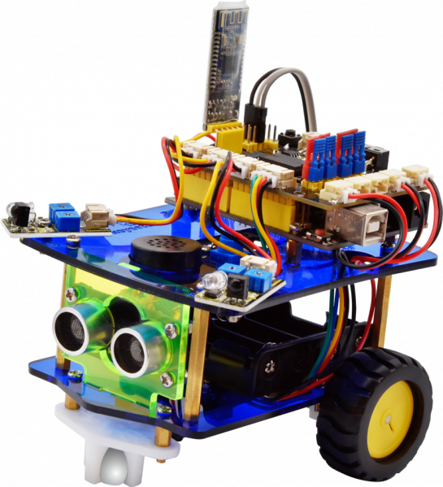

# KEYES ROBOT - ROBOMINI FIRMWARE

------

   
  Basic view of the robot (was taken from the site) 
  

## Description
### Alternative firmware project for KeyesRobot robots.

If you purchased the [Keyestudio Ks0441 Mini Bluetooth Smart Car V3.0](https://wiki.keyestudio.com/Ks0441_Keyestudio_Desktop_Mini_Bluetooth_Smart_Car_V3.0), you probably also felt the shortcomings of its implementation. Therefore, in order to get a more or less working solution, it is advisable to modify the firmware.
I used the same management protocol to be consistent with the existing management console. And also a map of all pins according to the existing implementation.
The main innovation is support for events. This firmware connects to a timer interrupt and can generate delayed events. In this way, important functions such as smooth acceleration, running characters, servo scan movement with cart move and others can be realized.

## Design Highlights
* The code is rewritten in C++, which means you can use refactoring the code to work without Arduino code.
* The code contains the basic ideas, but is extensible
* Possibility of asynchronous events
* Allows you to play music and drive at the same time
* Due to the lack of feedback on the power board, unfortunately it is not possible to implement current control.

